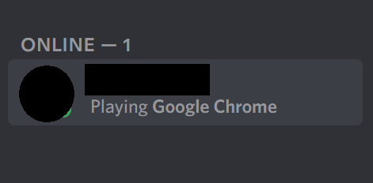
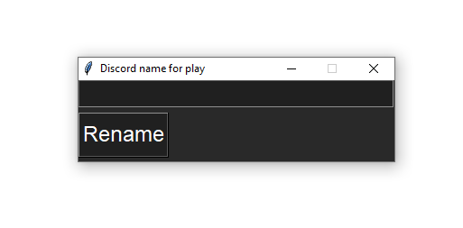
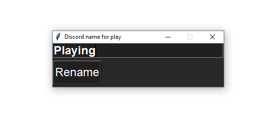
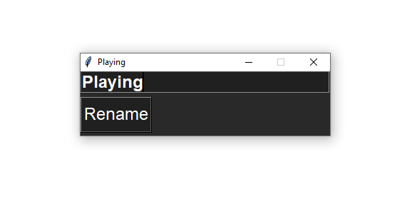
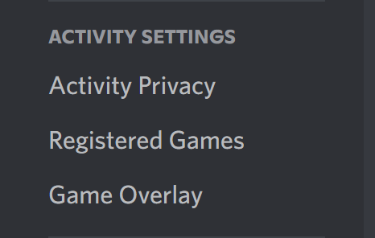
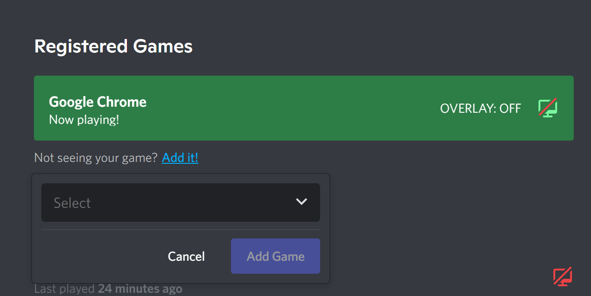
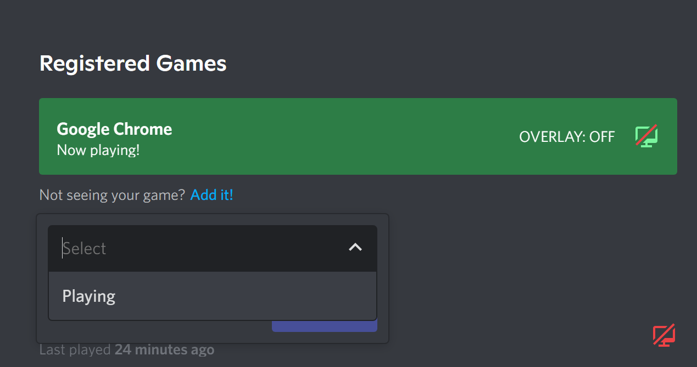
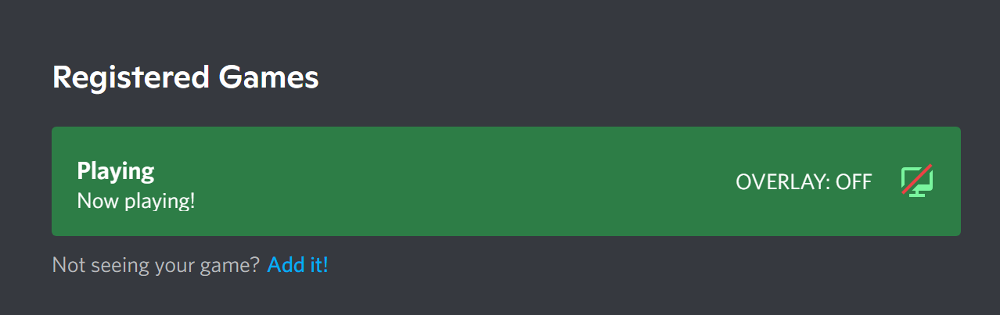
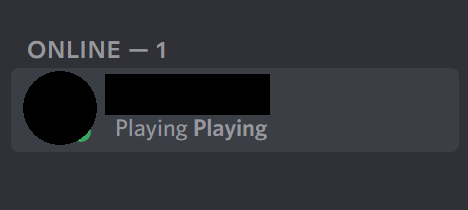

# Discord playing

## The program for the status of game activity in the Discord program.

##### Software scope: Computer system running "Windows 10 64 bit", "Windows 11 64bit", "Linux(Ubuntu) 64bit".
  

### The program will show the game name entered by the user as on "screenshot 1"

### The program looks like this:

### Enter the name you want. Click on Rename.

### Our program has changed its name.

### Open Discord. In the settings we are looking for the item "Activity settings", "Registered Games."

### Choose to add a game.

### Ready! We have a new activity status.

